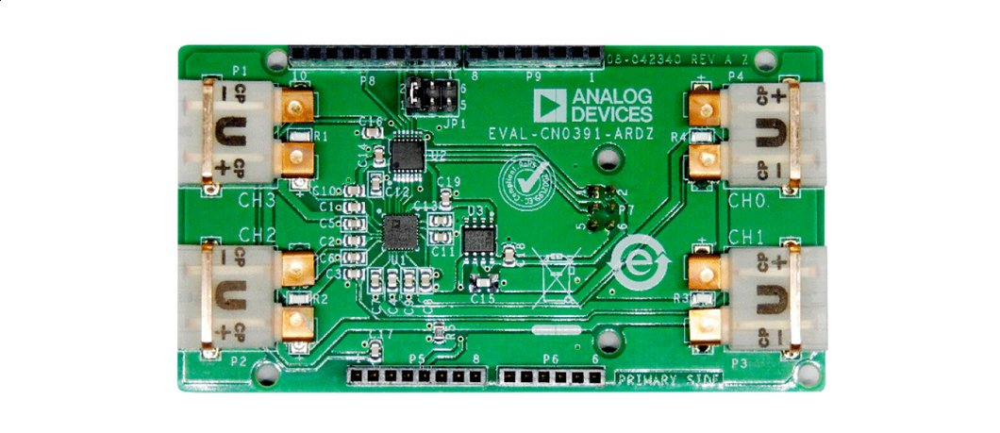

# CN0391 Thermocouple Library
This is a repackaged version of Analog Devices' [CN0391 example](https://github.com/analogdevicesinc/arduino/tree/master/Arduino Uno R3/examples/CN0391_example) into a standard Arduino library.  For more details on the shield and the library itself, see the following article:

- [4-Channel Thermocouple Demo using the Arduino Uno](https://wiki.analog.com/resources/eval/user-guides/arduino-uno/reference_designs/demo_cn0391)

Moreover, the example `read_temps.ino` was written by an __unknown author__. It is the basis for the included `basicCN0391` class included in the library. Credit goes to this person/group. 
